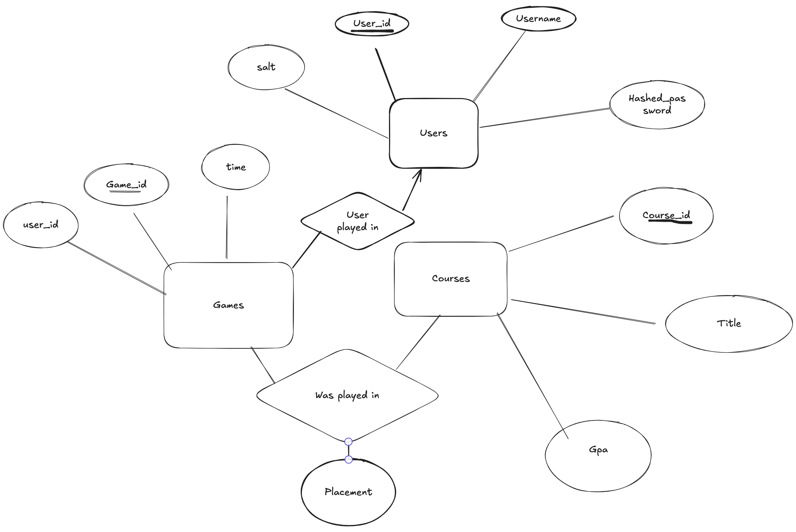

# DIS-Project
This is a project for the course 'Databases and Information Systems' at the University of Copenhagen. It is a game about guessing the average GPA's on different courses at the university. 

The GPA was scraped and cleaned from the [kurser.ku.dk](https://kurser.ku.dk), using the files in `scraping/`. The web application is built using Flask that connects to a local PostgreSQL database.

## Features
 - User accounts with login and registration, including password salt and hash
 - User profile with statistics on the number of games played, average score.
 - Leaderboard based on either user or game statistics.
 - Game mode where the user guesses the average GPA of a course.


## Installation
Setup using `init.sh` script is shown below:
```bash
# make sure to clone the repository from
https://github.com/Balyeat/DIS-Project.git
# change directory 
cd DIS-Project
# run the init.sh
./init.sh
# run the python3 main.py
python3 main.py
```

Alternatively, you can follow these steps to setup manually:
```bash
# first clone from repository from
git clone https://github.com/Balyeat/DIS-Project.git
# change directory
cd DIS-project
# if on MacOS run pip3 instead
pip install -r requirements.txt
# run the script to create .env file
./createdotenv.sh
# next load the db schema and initial data
psql < setup.sql
# next load the dummy_data into the database
psql < dummy_data.sql
# next run flask, replace python by python3 on MacOS
python main.py
# open url: http://127.0.0.1:5151
```

## Using the application
You can register a new user account, be aware of the strict password requirements, that are checked using regular expressions. You are also welcome to use the test user account, preloaded with data:
- Username: `Test123123`
- Password: `Test123123`

## ER Diagram


### Desicription
We have 3 entities users, games and courses.
We use a foreign key for our relationship between, games and users, because a game can't exist without a user
Then we have a "was_played_in" relationship between games and courses, to see which courses were in what games, and their placement.